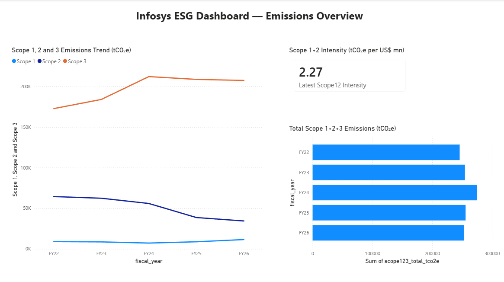
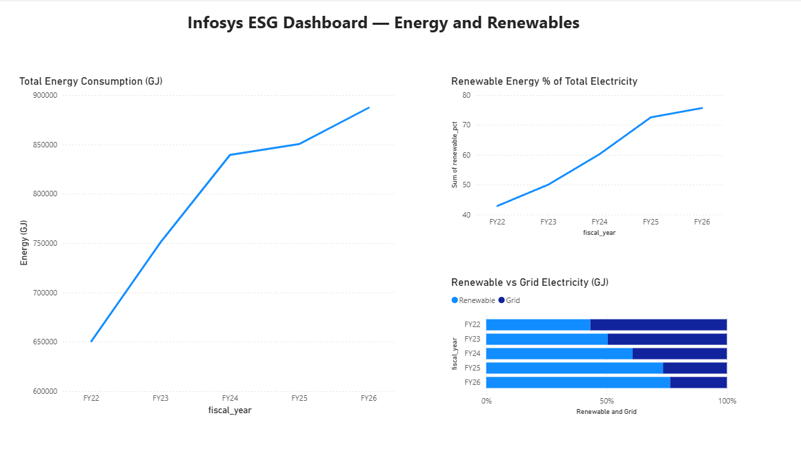
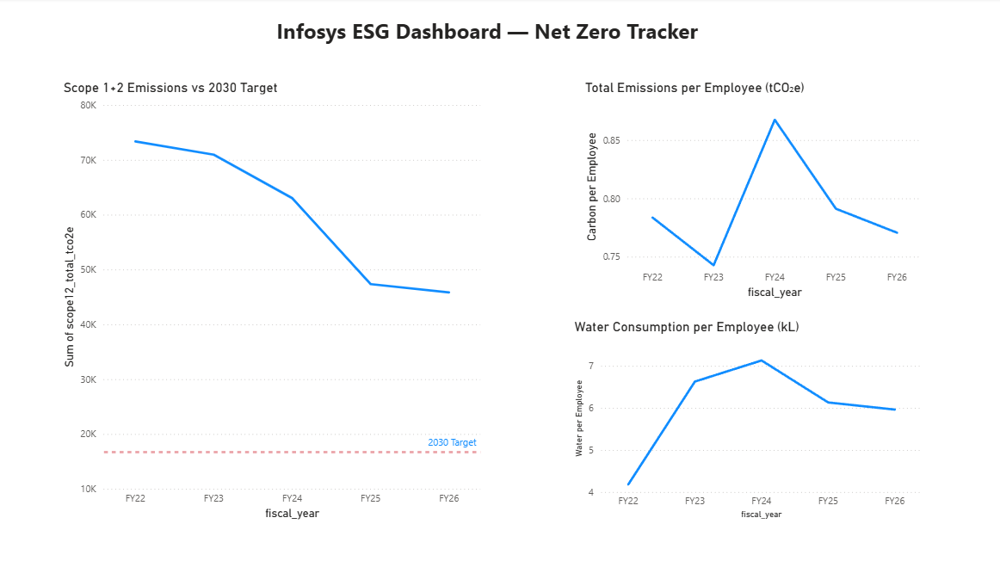

# ESG Carbon and Energy Trend Analysis — Infosys Ltd

## Project Overview
A 5-year ESG data analysis of Infosys Limited covering FY2022 to FY2026, examining carbon emissions, energy consumption, renewable energy adoption, water efficiency, and Net Zero target progress. Data was extracted directly from Infosys's publicly available ESG Data Books.

This project demonstrates end-to-end ESG data analyst skills — data extraction from real sustainability reports, data cleaning and structuring, SQL-based analysis, and Power BI dashboard development.

---

## Tools Used
- **Excel** — Data extraction, cleaning, and structuring
- **SQLite (DB Browser)** — Data import and SQL analysis
- **Power BI** — Interactive dashboard development

---

## Data Sources
- Infosys ESG Data Book 2021-22
- Infosys ESG Data Book 2022-23
- Infosys ESG Data Book 2023-24
- Infosys ESG Data Book 2024-25
- Infosys ESG Data Book 2025-26

All data sourced from Infosys's official investor relations and sustainability disclosures.

---

## Methodology
1. Manually extracted environmental, energy, workforce, and financial metrics from all five ESG Data Books
2. Audited data for restatements, boundary changes, and unit inconsistencies across years
3. Built a clean master dataset (ESG_Infosys_Master.xlsx) structured for SQL import
4. Wrote 10 SQL queries in SQLite covering trend analysis, intensity calculations, Scope 3 decomposition, and Net Zero gap analysis
5. Built a 3-page Power BI dashboard to visualise key findings

**Key data quality note:** Infosys restated FY24 and FY25 Scope 3 figures in the FY26 Data Book due to the addition of a new category — Purchased Goods and Services. This analysis uses the most recently restated figures throughout.

---

## Files in This Repository
| File | Description |
|---|---|
| ESG_Infosys_Master.xlsx | Cleaned master dataset with all metrics FY22–FY26 |
| ESG_Infosys_Queries.sql | 10 SQL queries with business question comments |
| Dashboard_Page1_Emissions.png | Power BI — Emissions Overview page |
| Dashboard_Page2_Energy.png | Power BI — Energy and Renewables page |
| Dashboard_Page3_NetZero.png | Power BI — Net Zero Tracker page |

---

## Key Findings

### 1. Scope 1+2 Emissions — Strong Reduction but Slowing
Infosys reduced Scope 1+2 emissions by 37% between FY22 and FY26 through aggressive renewable energy procurement. However the pace slowed sharply in FY26 — only 3.16% reduction compared to 24.91% in FY25. Scope 1 direct emissions actually increased 31% in FY26, partially offsetting Scope 2 gains.

### 2. Energy Intensity — Post-COVID Expansion Reversed Progress
Energy intensity worsened significantly during post-COVID office reopening (FY22–FY24), peaking at 45.22 GJ per US$ million in FY24. Improvement began in FY25 as renewable procurement offset consumption growth — but gains are slowing with only 0.25% improvement in FY26.

### 3. Renewable Energy — Impressive Growth but Approaching a Ceiling
Renewable electricity share grew from 42.87% in FY22 to 75.66% in FY26. However annual growth rate dropped sharply from ~20% per year to just 4.29% in FY26. The easy gains are behind them — achieving the final 25% will require significantly harder procurement and infrastructure decisions.

### 4. Carbon Per Employee — Scope 2 Success, Scope 3 Challenge
Infosys's renewable energy strategy drove Scope 2 per employee down by over 50% since FY22. However Scope 3 now represents over 80% of total emissions per employee — making travel, commute, and supply chain the next critical frontier for reduction.

### 5. Net Zero 2030 Target — At Serious Risk
Infosys needs to reduce Scope 1+2 by a further 63.56% from FY26 levels to hit their 2030 target of 16,700 tCO₂e. With only 4 years remaining and FY26 delivering just 1,497 tCO₂e of reduction against a required 7,283 per year, the pace needs to accelerate nearly 5x. At current trajectory, the 2030 Climate Positive commitment is at risk.

### 6. Water Efficiency — Post-COVID Recovery Incomplete
Water consumption per employee spiked 58.61% in FY23 as campuses reopened. Despite two consecutive years of reduction, Infosys in FY26 still consumes 42% more water per employee than FY22 levels. Post-COVID water efficiency has not been recovered.

### 7. Scope 3 — Return to Office is the Biggest ESG Risk
Employee commute emissions grew 1,165% from FY22 to FY26. Business travel grew 160%. Together these two people-movement categories account for 48.38% of all Scope 3 emissions in FY26. Infosys's return-to-office strategy is directly driving their fastest-growing emission sources. Work from home emissions fell 55% over the same period — but commute growth is far outpacing WFH reduction.

### 8. What Drove Total Emission Changes
In FY23 and FY24, Scope 3 growth overwhelmed Scope 1+2 reductions, causing total emissions to rise despite renewable progress. The turning point was FY25 when renewable procurement finally drove Scope 2 down fast enough — with Scope 1+2 responsible for 82% of total emission reduction that year. FY26 shows both scopes contributing roughly equally to a much smaller total reduction.

---

## Dashboard Preview

### Emissions Overview

### Energy and Renewables

### Net Zero Tracker

---

## Recommendations

Based on the findings of this analysis, the following actions are recommended for Infosys to strengthen its Net Zero 2030 trajectory:

1. **Accelerate Scope 1+2 reduction pace immediately.** At current trajectory, Infosys needs to reduce Scope 1+2 emissions nearly 5x faster than FY26 performance to hit the 2030 target of 16,700 tCO₂e. Renewable energy procurement alone will be insufficient — direct emission reduction measures for owned facilities and fuel consumption must be prioritised.

2. **Introduce a structured business travel policy with carbon budgets.** Business travel is the single largest Scope 3 category at 26.92% of total Scope 3 in FY26, having grown 160% since FY22. Introducing per-employee or per-business-unit carbon budgets for travel, alongside mandatory virtual-first meeting policies for domestic travel, would directly address the largest controllable Scope 3 source.

3. **Develop an employee commute programme.** Employee commute emissions grew 1,165% between FY22 and FY26 — the fastest-growing emission source in Infosys's entire portfolio. Subsidised public transport, carpooling incentives, EV charging infrastructure at campuses, and expanded hybrid work options would reduce this category significantly.

4. **Target 100% renewable electricity procurement by FY28.** Renewable energy share growth slowed to 4.29% in FY26 after averaging ~20% annually in prior years. The final 25% to full renewable coverage requires proactive long-term power purchase agreements (PPAs) and on-site solar expansion, particularly at high-consumption campuses like SIRA and Hyderabad SEZ.

5. **Engage top suppliers on Scope 3 Category 1 emissions.** Purchased Goods and Services — newly added in FY26 at 14.56% of Scope 3 — represents a significant and growing category. Supplier ESG scorecards, procurement policies favouring low-carbon vendors, and supplier capacity building programmes would address this emerging risk.

---

## Limitations

- Analysis is based entirely on publicly disclosed data. Metrics not reported by Infosys cannot be included or verified.
- Emission factors and calculation methodologies may change between reporting years, affecting comparability.
- Scope 3 figures for FY24 and FY25 were restated in the FY26 Data Book due to the addition of the Purchased Goods and Services category. Earlier Data Books show different figures for the same years.
- Scope 2 emissions are reported on a market-based basis. Location-based figures are only available for FY26, limiting year-on-year location-based comparison.
- Employee commute boundary expanded over the analysis period — earlier years cover fewer geographies, understating true commute emissions in FY22 and FY23.
- This analysis assumes Infosys's reported data is accurate and has been verified by their external assurance providers.

---

## About This Project
Built as part of a self-directed ESG Data Analytics portfolio. Background includes a Master's in Sustainable Design and green building consulting experience across IGBC and GRIHA projects in India. LEED Green Associate certified.
